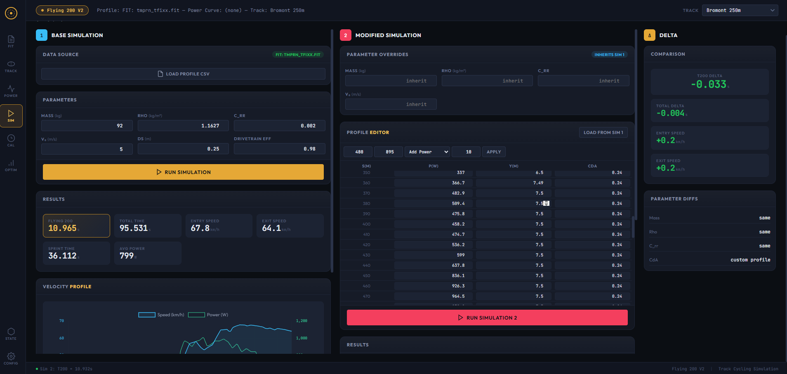

# Flying 200 — track cycling time-trial simulator and optimizer

A physics simulator for the **Flying 200 m** event in track cycling. Drop in a power
file from a real ride, and the tool detects the effort, calibrates an aerodynamic
model against the actual lap time, then proposes a faster pacing and line strategy.



The shot above is the Simulate tab with two parallel runs side-by-side: baseline (left)
locked to a real 10.965 s effort, modified (middle) with editable parameter overrides
and an inline profile editor, delta panel (right) showing the per-metric difference.

The Flying 200 is the qualifier for the Sprint event in track cycling. The rider
gets a 300 m flying wind-up, then is timed over the final 200 m. Tens of milliseconds
matter; the difference between a podium and tenth place is often under 100 ms.
This tool exists because there's no off-the-shelf software that models the event
properly — commercial bike-fit tools assume road-bike steady-state, not a 60 km/h
banked-track sprint with position-dependent aerodynamics.

## What's in here

- A **forward-Euler physics simulator** (`core/physics.py`) over the 895 m of track
  preceding the line, with section-aware drag (straights vs 42° banking), rolling
  resistance, drivetrain efficiency, and a Coggan-style W' depletion budget.
- A **FIT file pipeline** (`fit/`) that detects the rider's Flying 200 effort in a
  noisy training session, converts it from time-domain to distance-domain power,
  and aligns it to the 895 m course.
- Two **optimizers** (`optimizer/`):
  - *Energy-budget redistribution*: hold total energy constant, find the W·m
    distribution that minimizes time.
  - *Power-redistribution*: small per-segment power tweaks that respect a measured
    rider power-duration curve and W' constraints.
- A **Flask web GUI** (`gui/web/`) with a single-file frontend — uploads, sim runs,
  optimizer runs, charts, all in the browser.
- A **Tkinter desktop GUI** (`gui/`) for users who don't want the browser surface.

## Quickstart

```bash
pip install -r requirements.txt

# run the test suite
python -m pytest tests/

# launch the web GUI (browser opens at http://localhost:5200)
python __main__.py --web
```

Upload `tests/fixtures/flying200_sample.fit` from the UI to see the full flow with
a real ride attached.

## Engineering notes

This is a portfolio extract from a working tool I use for my own training. A
few of the design decisions worth pointing out:

- **The detector is two-tier.** Real FIT files have multiple efforts in one
  session — match sprints, team sprints, the actual Flying 200. The strict
  detector validates ramp shape, monotonic speed buildup, and rejects standing
  starts; the fallback only requires a clean power dropoff. See
  [fit/detector.py](fit/detector.py).
- **The optimizer's per-segment power ceiling is `max(curve(1s), 1.05 × baseline)`.**
  The baseline is what the rider actually did; the curve is what they "can" do.
  When those disagree (and they often do), the rider's measured output wins.
  See [optimizer/power_redistribution.py](optimizer/power_redistribution.py).
- **The web server has snapshot/restore endpoints** specifically so the E2E
  test can run against a live instance without trampling whatever the user has
  loaded. See [gui/web/server.py](gui/web/server.py) and
  [tests/test_session_snapshot.py](tests/test_session_snapshot.py).
- **The serializer scrubs Infinity/NaN to null** because Flask's JSON writer
  emits them as bare tokens, and `JSON.parse` in the browser throws on those.
  See [gui/web/serializers.py](gui/web/serializers.py) and
  [tests/test_json_finiteness.py](tests/test_json_finiteness.py).
- **There's a static UI audit** that walks `index.html` for every
  `getElementById` call and asserts a matching DOM id exists. Catches dead
  handlers at test time instead of at user-click time.
  See [tests/test_ui_static_audit.py](tests/test_ui_static_audit.py).

A more detailed orientation, intended for an AI agent reading the repo on
behalf of a reviewer, lives in [CLAUDE.md](CLAUDE.md).

## Limitations (called out so you don't have to find them)

- **Single-user, in-memory.** The server keeps state in process memory, no
  database, no auth. Restart wipes everything. This is on purpose — it's a
  desktop tool, not a SaaS.
- **Dev server only.** Flask's built-in server, not a production WSGI host.
- **Windows-tested.** Should work on macOS/Linux but I haven't shaken it out.
- **Track geometry is hard-coded** to a 250 m velodrome (12° straights, 42° bends).
  Adapting to a 333 m or 200 m track would be a config change in
  [core/physics.py](core/physics.py).

## License

MIT — see [../LICENSE](../LICENSE) at the repo root.
